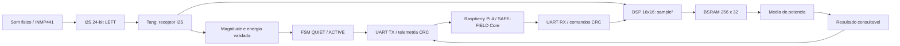
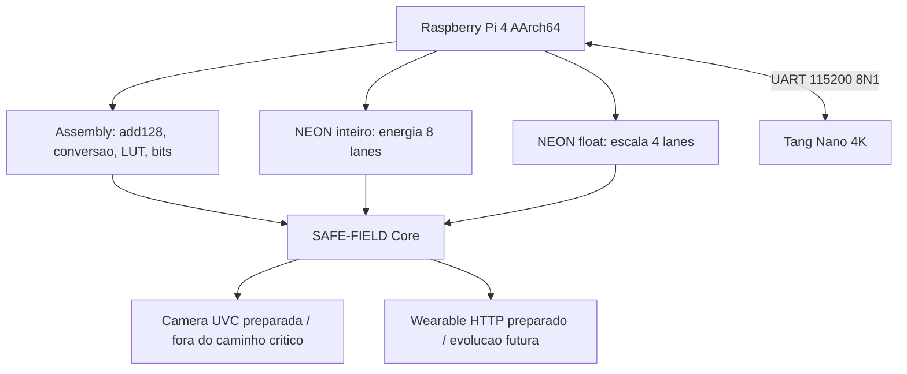

# Arquitetura SAFE-FIELD TP4

## Evolução TP3 -> TP4

O caminho GPIO17 já validado permanece como override determinístico. O TP4
acrescenta aquisição acústica I2S real, processamento no FPGA, BSRAM e DSP
dedicados, telemetria com CRC, recepção de comandos numéricos e rotinas AArch64
com NEON. Câmera, wearable físico, transcrição, IA e transporte PCM completo
continuam fora do caminho crítico.

## Domínios preservados

- áudio final: `safe_field_tp4_validated.fs`, imutável;
- bridge FPGA->Pi: build separado e fisicamente aprovado;
- build acadêmico bidirecional: `safe_field_tp4_official_bidirectional.fs`,
  programado somente em SRAM e fisicamente aprovado;
- GPIO17, I2S e LED mantêm os package pins 40/41/42/43/45/10;
- RX acadêmico usa package pin 46 com câmera desconectada; 3/3 comandos físicos
  retornaram expected=actual, CRC=0 e perdas=0.
