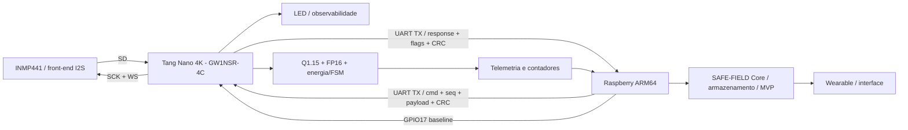

# Arquitetura final SAFE-FIELD TP5

## Separacao de responsabilidades

A Tang executa aquisicao I2S, processamento numerico deterministico, FSM, validacao de protocolo, CRC, contadores e telemetria. O Raspberry executa bibliotecas ARM64, syscalls Linux, parsing, buffers, registro, medicao e integracao com o Core. O wearable e a IA permanecem acima do enlace embarcado e nao substituem a decisao deterministica do FPGA.

## Hardware real

O enunciado cita Raspberry Pi Zero 2 W como plataforma-alvo. A bancada disponivel usa Raspberry Pi 4 Model B com Raspberry Pi OS 64-bit; ambos executam AArch64 e mantem a mesma interface logica. O relatorio declara explicitamente essa adaptacao, sem afirmar que o Pi 4 e o Zero 2 W fisicamente identicos.
