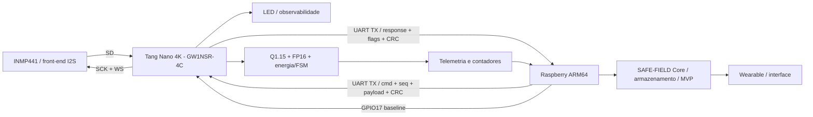

# Arquitetura final SAFE-FIELD TP5

## Separacao de responsabilidades

A Tang executa aquisicao I2S, processamento numerico deterministico, FSM, validacao de protocolo, CRC, contadores e telemetria. O Raspberry executa bibliotecas ARM64, syscalls Linux, parsing, buffers, registro, medicao e integracao com o Core. O wearable e a IA permanecem acima do enlace embarcado e nao substituem a decisao deterministica do FPGA.

## Hardware real

O enunciado cita Raspberry Pi Zero 2 W como plataforma-alvo. A bancada disponivel usa Raspberry Pi 4 Model B com Raspberry Pi OS 64-bit; ambos executam AArch64 e mantem a mesma interface logica. O relatorio declara explicitamente essa adaptacao, sem afirmar que o Pi 4 e o Zero 2 W fisicamente identicos.

## Estado de verificacao da baseline final (13/09/2026)

O caminho FPGA -> Raspberry foi verificado fisicamente com a imagem SRAM final no Pi 4: smoke RAW24 de 3 s, 3966 frames/63456 amostras, CRC, perdas e erros de frame iguais a zero. O caminho Raspberry -> FPGA também foi verificado: GPIO14/pino 8 chegou ao pin 46 (`rx_low_seen=true`), houve comando observado e resposta válida, com flags `0x94` e zero checksum/framing/I²S/overrun.

O caminho Raspberry -> FPGA foi verificado fisicamente no probe limpo: GPIO14/pino 8 chegou ao pin 46 (`rx_low_seen=true`), houve comando observado e resposta válida; flags `0x94`, sem checksum/framing/I²S/overrun. O enlace RAW24 e o protocolo de comandos coexistem na imagem final. Bidirecionalidade, operações numéricas, burst e estabilidade de 600 s foram verificados; PDF/ZIP e vídeo continuam pendentes de entrega.
